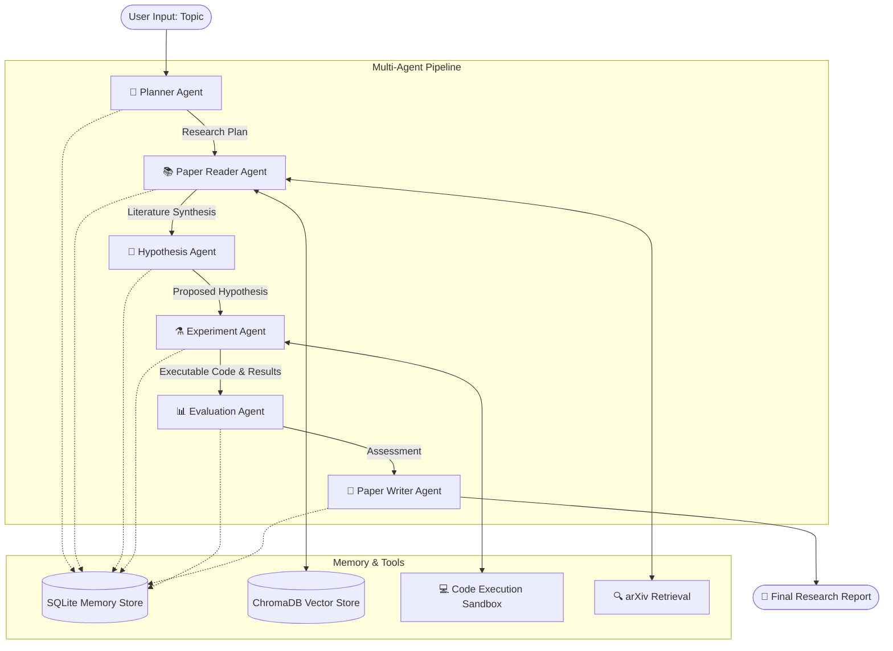

# 🧬 AI Research Agent

<p align="center">
  <em>Autonomous Research Scientist — Multi-Agent AI Lab</em>
</p>

An AI-powered multi-agent system that automates the scientific research workflow. Give it a research topic, and it will retrieve papers, identify gaps, generate hypotheses, design experiments, evaluate results, and write a research report — all autonomously.

---

## ✨ Features

- 🧠 **6 Specialized AI Agents** — Planner, Paper Reader, Hypothesis Generator, Experiment Designer, Evaluator, Paper Writer.
- � **Interactive Agent Chat** — Chat directly with individual agents to refine hypotheses, adjust plans, or modify experimental code during the research process.
- �📚 **Automatic Literature Retrieval** — Searches arXiv for relevant papers and creates a synthesized knowledge base.
- 🔬 **Research Gap Analysis** — Autonomously identifies limitations in existing work and proposes novel approaches.
- ⚗️ **Experiment Code Generation** — Generates and safely executes complete PyTorch experiment code in a sandboxed Jupyter-like environment.
- 📊 **Analytical Evaluation** — Compares execution results against literature benchmarks to assess the validity of the hypothesis.
- 📝 **Research Report Generation** — Synthesizes all findings into a full academic paper draft (Abstract → Conclusion).
- 🌐 **Beautiful Dark UI** — Real-time pipeline visualization, interactive canvas, and Server-Sent Events (SSE) streaming.
- ⚙️ **Flexible LLM Support** — Works with OpenAI, Groq, OpenRouter, or local LLMs dynamically configurable via the UI.

---

## 🏗️ System Architecture

The system follows a sequential yet highly interactive pipeline. Each stage is handled by a specialized LLM agent, retaining context through a shared memory layer.



---

## 🚀 Quick Start

### Prerequisites

- **Python 3.10+**
- An **LLM API key** (OpenAI, Groq, OpenRouter, etc.)

### Installation

```bash
# Clone the repository
git clone <your-repo-url>
cd AI_Researcher

# Create a virtual environment (optional but recommended)
python -m venv venv
source venv/bin/activate  # On Windows: venv\Scripts\activate

# Install dependencies
pip install -r requirements.txt
```

### Usage

1. Start the backend server:
   ```bash
   python main.py
   ```
2. Open **http://localhost:8000** in your web browser.
3. Click the **⚙️ Settings** icon in the top right to configure your API Key and Model.
4. Enter a research topic (e.g., "Deepfake Detection using Vision Transformers").
5. Click **🚀 Start Research** and watch the agents collaborate!

---

## 💎 MVP Design Details

The AI Research Agent MVP focuses on a robust, locally runnable web application with real-time feedback. 

### Core Components
1. **Frontend**: Pure HTML/CSS/JavaScript. No heavy frameworks. It utilizes Server-Sent Events (SSE) to stream live status updates, logs, and UI state changes from the executing agents to the browser.
2. **Backend**: Built with **FastAPI**. It handles complex LLM routing, prompt injection, and sandbox management.
3. **Agentic Framework**: Uses LangChain/LiteLLM interfaces to standardize communication across various LLM providers.
4. **Data Persistence**: Uses a local SQLite database (`research_data/memory.db`) to log conversation history, selected plans, and intermediate artifacts for session reconstructability.

### Agent Capabilities
- **Planner**: Generates multiple research angles; user can select the best one or let the system auto-select.
- **Paper Reader**: Uses RAG (Retrieval-Augmented Generation) with ChromaDB to chunk and comprehend lengthy arXiv PDFs.
- **Experimenter**: Features a Jupyter-like canvas UI. It spawns an isolated Python subprocess to execute code and captures `stdout`/`stderr` alongside Base64 encoded Matplotlib figures.

---

## 📁 Project Structure

```text
AI_Researcher/
├── main.py                  # FastAPI application entry point
├── requirements.txt         # Python dependencies
├── .gitignore               # Git ignore configuration
├── backend/
│   ├── config.py            # Dynamic runtime configuration
│   ├── models.py            # Pydantic data models for typed interfaces
│   ├── routes.py            # API routes (Chat, Config, SSE stream)
│   ├── pipeline.py          # State-machine orchestration for the agents
│   ├── agents/              # The 6 specialized LLM agents
│   └── tools/               # Independent tool implementations (Arxiv, Sandbox)
└── frontend/
    ├── index.html           # Main SPA layout
    ├── styles.css           # Premium Dark Theme CSS
    └── app.js               # Event handling, DOM manipulation, SSE listener
```

---

## 🔑 API Configuration

The system is highly agnostic to the underlying LLM. You can configure this directly in the UI. 
- **Groq**: Extremely fast, great for rapid testing (`llama3-70b-8192`).
- **OpenAI**: Best reasoning capabilities for complex experiments (`gpt-4o`).
- **OpenRouter**: Access to a wide variety of open-source and proprietary models.

---

## 📜 License

MIT License. See the `LICENSE` file for more details.
